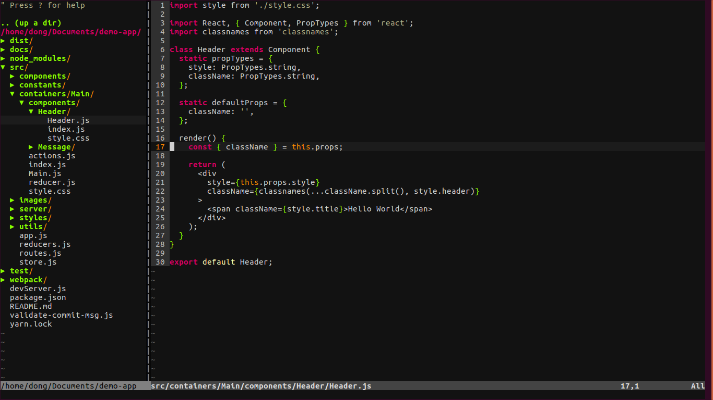

> # to-vim



# 安装
```
sudo apt-get install vim  // Ubuntu
```

# 新手指南
```
vimtutor  // vim 教程
```

## `移动光标`
```
# hjkl
# 2w 向前移动两个单词
# 3e 向前移动到第 3 个单词的末尾
# 0 移动到行首
# $ 当前行的末尾
# gg 文件第一行
# G 文件最后一行
# 行号+G 指定行
# <ctrl>+o 跳转回之前的位置
# <ctrl>+i 返回跳转之前的位置
```

## `退出`
```
# <esc> 进入正常模式
# :q! 不保存退出
# :wq 保存后退出
```

## `删除`
```
# x 删除当前字符
# dw 删除至当前单词末尾
# de 删除至当前单词末尾，包括当前字符
# d$ 删除当前行尾
# dd 删除整行
# 2dd 删除两行
```

## `修改`
```
# i 插入文本
# A 当前行末尾添加
# r 替换当前字符
# o 打开新的一行并进入插入模式
```

## `撤销`
```
# 撤销
# <ctrl>+r 取消撤销
```

## `复制粘贴剪切`
```
# v 进入可视模式
# y 复制
# p 粘贴
# yy 复制当前行
# dd 剪切当前行
```

## `状态`
```
# <ctrl>+g 显示当前行以及文件信息
```

## `查找`
```
# / 正向查找（n：继续查找，N：相反方向继续查找）
# ？ 逆向查找
# % 查找配对的 {，[，(
# :set ic 忽略大小写
# :set noic 取消忽略大小写
# :set hls 匹配项高亮显示
# :set is 显示部分匹配
```

## `替换`
```
# :s/old/new 替换该行第一个匹配串
# :s/old/new/g 替换全行的匹配串
# :%s/old/new/g 替换整个文件的匹配串
```

## `执行外部命令`
```
# :!shell 执行外部命令
```

# 配置
```
cd Home               // 进入 Home 目录
touch .vimrc          // 配置文件
touch .vimrc.bundles  // 插件管理文件
```

## .vimrc
### `取消备份`
```
set nobackup
set noswapfile
```

### `文件编码`
```
set encoding=utf-8
```

### `显示行号`
```
set number
```

### `取消换行`
```
set nowrap
```

### `显示光标当前位置`
```
set ruler
```

### `设置缩进的宽度`
```
set tabstop=2
```

### `突出显示当前行`
```
set cursorline
```

### `左下角显示当前vim模式`
```
set showmode
```

### `代码折叠`
```
# 启动 vim 时关闭折叠代码
set nofoldenable
```

### `主题`
```
syntax enable
set background=dark
colorscheme solarized
```
[altercation/vim-colors-solarized](https://github.com/altercation/vim-colors-solarized)
[Anthony25/gnome-terminal-colors-solarized](https://github.com/Anthony25/gnome-terminal-colors-solarized)

## .vimrc.bundles
```
# 使用 vunble 管理插件
$ git clone https://github.com/VundleVim/Vundle.vim.git ~/.vim/bundle/Vundle.vim
```

### `树形目录`
```
Plugin 'scrooloose/nerdtree'			" tree
Plugin 'jistr/vim-nerdtree-tabs'		" tab
Plugin 'Xuyuanp/nerdtree-git-plugin'	" git

# 自动打开 vim
autocmd vimenter * NERDTree
# 打开关闭 vim
map <C-n> :NERDTreeToggle<CR>
# o 打开关闭文件或目录
# e 以文件管理的方式打开选中的目录
# t 在标签页中打开
# T 在标签页中打开，但光标仍然留在 NERDTree
# r 刷新光标所在的目录
# R 刷新当前根路径
# I 显示隐藏文件
# C 将根路径设置为光标所在的目录
# u 设置上级目录为根路径
# ctrl + w + w 光标自动在左右侧窗口切换
# ctrl + w + r 移动当前窗口的布局位置
# :tabc 关闭当前的 tab
# :tabo   关闭所有其他的 tab
# :tabp   前一个 tab
# :tabn   后一个 tab
# gT      前一个 tab
# gt      后一个 tab
```
[scrooloose/nerdtree](https://github.com/scrooloose/nerdtree)


### `代码，引号自动补全`
```
Plugin 'Valloric/YouCompleteMe'
Plugin 'Raimondi/delimitMate'
```
[Valloric/YouCompleteMe](https://github.com/Valloric/YouCompleteMe)
[Raimondi/delimitMate](https://github.com/Raimondi/delimitMate)

### `文件，代码搜索`
```
Plugin 'rking/ag.vim'
Plugin 'kien/ctrlp.vim'
```
[kien/ctrlp.vim](https://github.com/kien/ctrlp.vim)
[ggreer/the_silver_searcher](https://github.com/ggreer/the_silver_searcher)
[rking/ag.vim](https://github.com/rking/ag.vim)

### `加强版状态栏`
```
Plugin 'vim-airline/vim-airline'
Plugin 'vim-airline/vim-airline-themes'

# 设置主题
let g:airline_theme='papercolor'
```
[vim-airline/vim-airline](https://github.com/vim-airline/vim-airline)
[vim-airline/vim-airline-themes](https://github.com/vim-airline/vim-airline-themes)

### `git`
```
Plugin 'airblade/vim-gitgutter'
```
[airblade/vim-gitgutter](https://github.com/airblade/vim-gitgutter)

### `Markdown`
```
Plugin 'suan/vim-instant-markdown'
[sudo] npm -g install instant-markdown-d

# 保存后打开
let g:instant_markdown_slow = 1
# 默认不打开
let g:instant_markdown_autostart = 0
# 打开
:InstantMarkdownPreview
```
[suan/vim-instant-markdown](https://github.com/suan/vim-instant-markdown)

### `代码注释`
```
Plugin 'scrooloose/nerdcommenter'

# <leader>cc // 注释
# <leader>cm 只用一组符号注释
# <leader>cA 在行尾添加注释
# <leader>c$ /* 注释 */
# <leader>cs /* 块注释 */
# <leader>cy 注释并复制
# <leader>c<space> 注释/取消注释
# <leader>ca 切换　// 和 /* */
# <leader>cu 取消注释

# 注释符号与注释内容之间空一格
let g:NERDSpaceDelims = 1
# 注释向左对齐
let g:NERDDefaultAlign = 'left'
# 自定义注释格式
let g:NERDCustomDelimiters = {
			\ 'javascript': { 'left': '//', 'leftAlt': '/**', 'rightAlt': '*/' },
			\ 'less': { 'left': '/**', 'right': '*/' }
		\ }
```
[scrooloose/nerdcommenter](https://github.com/scrooloose/nerdcommenter)

### `html 5`
```
Plugin 'othree/html5.vim'
```
[othree/html5.vim](https://github.com/othree/html5.vim)

### `css 3`
```
Plugin 'hail2u/vim-css3-syntax'
Plugin 'ap/vim-css-color'

augroup VimCSS3Syntax
  autocmd!

  autocmd FileType css setlocal iskeyword+=-
augroup END
```
[hail2u/vim-css3-syntax](https://github.com/hail2u/vim-css3-syntax)
[ap/vim-css-color](https://github.com/ap/vim-css-color)

### `JavaScipt`
```
Plugin 'pangloss/vim-javascript'

let g:javascript_plugin_jsdoc = 1
let g:javascript_plugin_ngdoc = 1
let g:javascript_plugin_flow = 1
set foldmethod=syntax
let g:javascript_conceal_function             = "ƒ"
let g:javascript_conceal_null                 = "ø"
let g:javascript_conceal_this                 = "@"
let g:javascript_conceal_return               = "⇚"
let g:javascript_conceal_undefined            = "¿"
let g:javascript_conceal_NaN                  = "ℕ"
let g:javascript_conceal_prototype            = "¶"
let g:javascript_conceal_static               = "•"
let g:javascript_conceal_super                = "Ω"
let g:javascript_conceal_arrow_function       = "⇒"
let g:javascript_conceal_noarg_arrow_function = "🞅"
let g:javascript_conceal_underscore_arrow_function = "🞅"
set conceallevel=1
```
[pangloss/vim-javascript](https://github.com/pangloss/vim-javascript)

### `React`
```
Plugin 'mxw/vim-jsx'

let g:jsx_ext_required = 0
```
[mxw/vim-jsx](https://github.com/mxw/vim-jsx)

### `Emmet`
```
Plugin 'mattn/emmet-vim'

let g:user_emmet_leader_key='<Tab>'
let g:user_emmet_settings = {
 		\ 'javascript.jsx' : {
    		\ 'extends' : 'jsx',
    	\ },
 		\ }
```
[mattn/emmet-vim](https://github.com/mattn/emmet-vim)

### 配置文件
* [.vimrc](./.vimrc)
* [.vimrc.bundles](./.vimrc.bundles)
